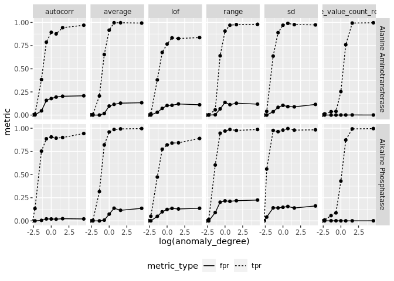
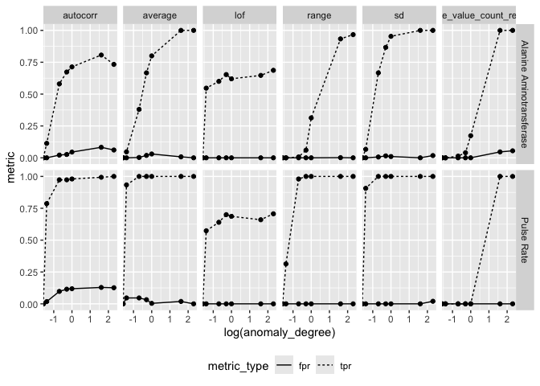
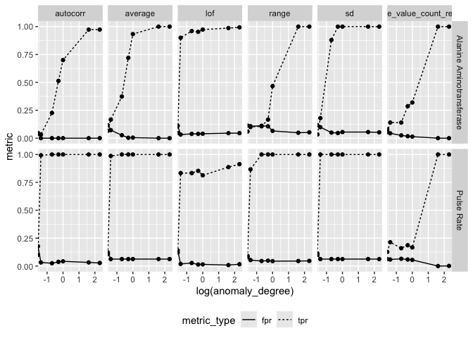

<!-- README.md is generated from README.Rmd. Please edit that file -->

# ctasval

<!-- badges: start -->

[](https://github.com/IMPALA-Consortium/ctasval/actions/workflows/R-CMD-check.yaml)

<!-- badges: end -->

The goal of ctasval is to provide structured code to validate {ctas}
performance on study data.

## Installation

You can install the development version of ctasval from
[GitHub](https://github.com/) with:

``` r
# install.packages("devtools")
devtools::install_github("IMPALA-Consortium/ctas")
devtools::install_github("IMPALA-Consortium/ctasval")
```

## ctasval

`ctasval` adds three anomalous sites to the data set for each iteration
and tries to detect them using {ctas}. It samples from the study site
pool to first determine the number of patients and then samples a
sufficient number of patients from the study patient pool.

``` r

library(pharmaversesdtm)
library(dplyr)
#> 
#> Attaching package: 'dplyr'
#> The following objects are masked from 'package:stats':
#> 
#>     filter, lag
#> The following objects are masked from 'package:base':
#> 
#>     intersect, setdiff, setequal, union
library(future)
library(ctasval)
library(ggplot2)
library(tidyr)


set.seed(1)

df_prep <- prep_sdtm(
  lb = pharmaversesdtm::lb,
  vs = pharmaversesdtm::vs,
  dm = pharmaversesdtm::dm,
  scramble = TRUE
)

df_filt <- df_prep %>%
  filter(parameter_id %in% c("Pulse Rate", "Alanine Aminotransferase")) %>%
  filter(! grepl("UNSCH", timepoint_1_name) & !timepoint_1_name %in% c("AMBUL ECG REMOVAL", "RETRIEVAL"))

plan(multisession, workers = 6)

ctas <- ctasval(
  df = df_filt,
  fun_anomaly = c(
    anomaly_average,
    anomaly_sd,
    anomaly_autocorr,
    anomaly_lof,
    anomaly_range,
    anomaly_unique_value_count_relative
  ),
  feats = c("average", "sd", "autocorr", "lof", "range", "unique_value_count_relative"),
  parallel = TRUE,
  iter = 50,
  n_sites = 3,
  anomaly_degree = c(0, 0.25, 0.5, 0.75, 1, 5, 10),
  thresh = 1.3,
  site_scoring_method = "ks"
)
#> Warning: There were 350 warnings in `mutate()`.
#> The first warning was:
#> ℹ In argument: `ctas = simaerep::purrr_bar(...)`.
#> Caused by warning:
#> ! There were 11 warnings in `mutate()`.
#> The first warning was:
#> ℹ In argument: `ts_features = list(...)`.
#> ℹ In row 2.
#> Caused by warning in `cor()`:
#> ! the standard deviation is zero
#> ℹ Run `dplyr::last_dplyr_warnings()` to see the 10 remaining warnings.
#> ℹ Run `dplyr::last_dplyr_warnings()` to see the 349 remaining warnings.

plan(sequential)

ctas
#> $result
#> # A tibble: 84 × 9
#>    anomaly_degree feats    parameter_id       TN    FN    FP    TP     tpr   fpr
#>             <dbl> <chr>    <chr>           <int> <int> <int> <int>   <dbl> <dbl>
#>  1              0 average  Alanine Aminot…   800   150     0     0 0           0
#>  2              0 average  Pulse Rate        800   150     0     0 0           0
#>  3              0 sd       Alanine Aminot…   800   150     0     0 0           0
#>  4              0 sd       Pulse Rate        800   150     0     0 0           0
#>  5              0 autocorr Alanine Aminot…   800   150     0     0 0           0
#>  6              0 autocorr Pulse Rate        800   150     0     0 0           0
#>  7              0 lof      Alanine Aminot…   800   150     0     0 0           0
#>  8              0 lof      Pulse Rate        800   149     0     1 0.00667     0
#>  9              0 range    Alanine Aminot…   800   150     0     0 0           0
#> 10              0 range    Pulse Rate        800   150     0     0 0           0
#> # ℹ 74 more rows
#> 
#> $anomaly
#> # A tibble: 3,623,201 × 17
#>     iter anomaly_degree fun_anomaly feats   subject_id    site  timepoint_1_name
#>    <int>          <dbl> <list>      <chr>   <chr>         <chr> <chr>           
#>  1     1              0 <fn>        average sample_site1… samp… SCREENING 1     
#>  2     1              0 <fn>        average sample_site1… samp… WEEK 2          
#>  3     1              0 <fn>        average sample_site1… samp… WEEK 4          
#>  4     1              0 <fn>        average sample_site1… samp… WEEK 6          
#>  5     1              0 <fn>        average sample_site1… samp… WEEK 8          
#>  6     1              0 <fn>        average sample_site1… samp… WEEK 12         
#>  7     1              0 <fn>        average sample_site1… samp… WEEK 16         
#>  8     1              0 <fn>        average sample_site1… samp… WEEK 20         
#>  9     1              0 <fn>        average sample_site1… samp… WEEK 24         
#> 10     1              0 <fn>        average sample_site1… samp… WEEK 26         
#> # ℹ 3,623,191 more rows
#> # ℹ 10 more variables: timepoint_2_name <chr>, timepoint_rank <dbl>,
#> #   parameter_id <chr>, parameter_name <chr>, parameter_category_1 <chr>,
#> #   baseline <lgl>, result <dbl>, method <chr>, score <dbl>, is_signal <dbl>
#> 
#> attr(,"class")
#> [1] "ctasval_aggregated"
```

### Performance Metrics

``` r
ctas$result %>%
  tidyr::pivot_longer(c(tpr, fpr), values_to = "metric", names_to = "metric_type") %>%
  ggplot(aes(log(anomaly_degree),  metric)) +
  geom_line(aes(linetype = metric_type)) +
  geom_point() +
  facet_grid(parameter_id ~ feats) +
  theme(legend.position = "bottom")
```



### Mixed Effect Scoring

``` r
plan(multisession, workers = 6)

ctas <- ctasval(
  df = df_filt,
  fun_anomaly = c(
    anomaly_average,
    anomaly_sd,
    anomaly_autocorr,
    anomaly_lof,
    anomaly_range,
    anomaly_unique_value_count_relative
  ),
  feats = c("average", "sd", "autocorr", "lof", "range", "unique_value_count_relative"),
  parallel = TRUE,
  iter = 50,
  n_sites = 3,
  anomaly_degree = c(0, 0.25, 0.5, 0.75, 1, 5, 10),
  thresh = 1.3,
  site_scoring_method = "mixedeffects"
)
#> boundary (singular) fit: see help('isSingular')
#> boundary (singular) fit: see help('isSingular')
#> boundary (singular) fit: see help('isSingular')
#> boundary (singular) fit: see help('isSingular')
#> boundary (singular) fit: see help('isSingular')
#> boundary (singular) fit: see help('isSingular')
#> boundary (singular) fit: see help('isSingular')
#> boundary (singular) fit: see help('isSingular')
#> boundary (singular) fit: see help('isSingular')
#> boundary (singular) fit: see help('isSingular')
#> boundary (singular) fit: see help('isSingular')
#> boundary (singular) fit: see help('isSingular')
#> boundary (singular) fit: see help('isSingular')
#> boundary (singular) fit: see help('isSingular')
#> boundary (singular) fit: see help('isSingular')
#> boundary (singular) fit: see help('isSingular')
#> boundary (singular) fit: see help('isSingular')
#> boundary (singular) fit: see help('isSingular')
#> boundary (singular) fit: see help('isSingular')
#> boundary (singular) fit: see help('isSingular')
#> boundary (singular) fit: see help('isSingular')
#> boundary (singular) fit: see help('isSingular')
#> boundary (singular) fit: see help('isSingular')
#> boundary (singular) fit: see help('isSingular')
#> boundary (singular) fit: see help('isSingular')
#> boundary (singular) fit: see help('isSingular')
#> boundary (singular) fit: see help('isSingular')
#> boundary (singular) fit: see help('isSingular')
#> boundary (singular) fit: see help('isSingular')
#> boundary (singular) fit: see help('isSingular')
#> boundary (singular) fit: see help('isSingular')
#> boundary (singular) fit: see help('isSingular')
#> boundary (singular) fit: see help('isSingular')
#> boundary (singular) fit: see help('isSingular')
#> boundary (singular) fit: see help('isSingular')
#> boundary (singular) fit: see help('isSingular')
#> boundary (singular) fit: see help('isSingular')
#> boundary (singular) fit: see help('isSingular')
#> boundary (singular) fit: see help('isSingular')
#> boundary (singular) fit: see help('isSingular')
#> boundary (singular) fit: see help('isSingular')
#> boundary (singular) fit: see help('isSingular')
#> boundary (singular) fit: see help('isSingular')
#> boundary (singular) fit: see help('isSingular')
#> boundary (singular) fit: see help('isSingular')
#> boundary (singular) fit: see help('isSingular')
#> boundary (singular) fit: see help('isSingular')
#> boundary (singular) fit: see help('isSingular')
#> boundary (singular) fit: see help('isSingular')
#> boundary (singular) fit: see help('isSingular')
#> boundary (singular) fit: see help('isSingular')
#> boundary (singular) fit: see help('isSingular')
#> boundary (singular) fit: see help('isSingular')
#> boundary (singular) fit: see help('isSingular')
#> boundary (singular) fit: see help('isSingular')
#> boundary (singular) fit: see help('isSingular')
#> boundary (singular) fit: see help('isSingular')
#> boundary (singular) fit: see help('isSingular')
#> boundary (singular) fit: see help('isSingular')
#> boundary (singular) fit: see help('isSingular')
#> boundary (singular) fit: see help('isSingular')
#> boundary (singular) fit: see help('isSingular')
#> boundary (singular) fit: see help('isSingular')
#> boundary (singular) fit: see help('isSingular')
#> boundary (singular) fit: see help('isSingular')
#> boundary (singular) fit: see help('isSingular')
#> boundary (singular) fit: see help('isSingular')
#> boundary (singular) fit: see help('isSingular')
#> boundary (singular) fit: see help('isSingular')
#> boundary (singular) fit: see help('isSingular')
#> boundary (singular) fit: see help('isSingular')
#> boundary (singular) fit: see help('isSingular')
#> boundary (singular) fit: see help('isSingular')
#> boundary (singular) fit: see help('isSingular')
#> boundary (singular) fit: see help('isSingular')
#> boundary (singular) fit: see help('isSingular')
#> boundary (singular) fit: see help('isSingular')
#> boundary (singular) fit: see help('isSingular')
#> boundary (singular) fit: see help('isSingular')
#> boundary (singular) fit: see help('isSingular')
#> boundary (singular) fit: see help('isSingular')
#> boundary (singular) fit: see help('isSingular')
#> boundary (singular) fit: see help('isSingular')
#> boundary (singular) fit: see help('isSingular')
#> boundary (singular) fit: see help('isSingular')
#> boundary (singular) fit: see help('isSingular')
#> boundary (singular) fit: see help('isSingular')
#> boundary (singular) fit: see help('isSingular')
#> boundary (singular) fit: see help('isSingular')
#> boundary (singular) fit: see help('isSingular')
#> boundary (singular) fit: see help('isSingular')
#> boundary (singular) fit: see help('isSingular')
#> boundary (singular) fit: see help('isSingular')
#> boundary (singular) fit: see help('isSingular')
#> boundary (singular) fit: see help('isSingular')
#> boundary (singular) fit: see help('isSingular')
#> boundary (singular) fit: see help('isSingular')
#> boundary (singular) fit: see help('isSingular')
#> boundary (singular) fit: see help('isSingular')
#> boundary (singular) fit: see help('isSingular')
#> boundary (singular) fit: see help('isSingular')
#> boundary (singular) fit: see help('isSingular')
#> boundary (singular) fit: see help('isSingular')
#> boundary (singular) fit: see help('isSingular')
#> boundary (singular) fit: see help('isSingular')
#> boundary (singular) fit: see help('isSingular')
#> boundary (singular) fit: see help('isSingular')
#> boundary (singular) fit: see help('isSingular')
#> boundary (singular) fit: see help('isSingular')
#> boundary (singular) fit: see help('isSingular')
#> boundary (singular) fit: see help('isSingular')
#> boundary (singular) fit: see help('isSingular')
#> boundary (singular) fit: see help('isSingular')
#> boundary (singular) fit: see help('isSingular')
#> boundary (singular) fit: see help('isSingular')
#> boundary (singular) fit: see help('isSingular')
#> boundary (singular) fit: see help('isSingular')
#> boundary (singular) fit: see help('isSingular')
#> boundary (singular) fit: see help('isSingular')
#> boundary (singular) fit: see help('isSingular')
#> boundary (singular) fit: see help('isSingular')
#> boundary (singular) fit: see help('isSingular')
#> boundary (singular) fit: see help('isSingular')
#> boundary (singular) fit: see help('isSingular')
#> boundary (singular) fit: see help('isSingular')
#> boundary (singular) fit: see help('isSingular')
#> boundary (singular) fit: see help('isSingular')
#> boundary (singular) fit: see help('isSingular')
#> boundary (singular) fit: see help('isSingular')
#> boundary (singular) fit: see help('isSingular')
#> boundary (singular) fit: see help('isSingular')
#> boundary (singular) fit: see help('isSingular')
#> boundary (singular) fit: see help('isSingular')
#> boundary (singular) fit: see help('isSingular')
#> boundary (singular) fit: see help('isSingular')
#> boundary (singular) fit: see help('isSingular')
#> boundary (singular) fit: see help('isSingular')
#> boundary (singular) fit: see help('isSingular')
#> boundary (singular) fit: see help('isSingular')
#> boundary (singular) fit: see help('isSingular')
#> boundary (singular) fit: see help('isSingular')
#> boundary (singular) fit: see help('isSingular')
#> boundary (singular) fit: see help('isSingular')
#> boundary (singular) fit: see help('isSingular')
#> boundary (singular) fit: see help('isSingular')
#> boundary (singular) fit: see help('isSingular')
#> boundary (singular) fit: see help('isSingular')
#> boundary (singular) fit: see help('isSingular')
#> boundary (singular) fit: see help('isSingular')
#> boundary (singular) fit: see help('isSingular')
#> boundary (singular) fit: see help('isSingular')
#> boundary (singular) fit: see help('isSingular')
#> boundary (singular) fit: see help('isSingular')
#> boundary (singular) fit: see help('isSingular')
#> boundary (singular) fit: see help('isSingular')
#> boundary (singular) fit: see help('isSingular')
#> boundary (singular) fit: see help('isSingular')
#> boundary (singular) fit: see help('isSingular')
#> boundary (singular) fit: see help('isSingular')
#> boundary (singular) fit: see help('isSingular')
#> boundary (singular) fit: see help('isSingular')
#> boundary (singular) fit: see help('isSingular')
#> boundary (singular) fit: see help('isSingular')
#> boundary (singular) fit: see help('isSingular')
#> boundary (singular) fit: see help('isSingular')
#> boundary (singular) fit: see help('isSingular')
#> boundary (singular) fit: see help('isSingular')
#> boundary (singular) fit: see help('isSingular')
#> boundary (singular) fit: see help('isSingular')
#> boundary (singular) fit: see help('isSingular')
#> boundary (singular) fit: see help('isSingular')
#> boundary (singular) fit: see help('isSingular')
#> boundary (singular) fit: see help('isSingular')
#> boundary (singular) fit: see help('isSingular')
#> boundary (singular) fit: see help('isSingular')
#> boundary (singular) fit: see help('isSingular')
#> boundary (singular) fit: see help('isSingular')
#> boundary (singular) fit: see help('isSingular')
#> boundary (singular) fit: see help('isSingular')
#> boundary (singular) fit: see help('isSingular')
#> boundary (singular) fit: see help('isSingular')
#> boundary (singular) fit: see help('isSingular')
#> boundary (singular) fit: see help('isSingular')
#> boundary (singular) fit: see help('isSingular')
#> boundary (singular) fit: see help('isSingular')
#> boundary (singular) fit: see help('isSingular')
#> boundary (singular) fit: see help('isSingular')
#> boundary (singular) fit: see help('isSingular')
#> boundary (singular) fit: see help('isSingular')
#> boundary (singular) fit: see help('isSingular')
#> boundary (singular) fit: see help('isSingular')
#> boundary (singular) fit: see help('isSingular')
#> boundary (singular) fit: see help('isSingular')
#> boundary (singular) fit: see help('isSingular')
#> boundary (singular) fit: see help('isSingular')
#> boundary (singular) fit: see help('isSingular')
#> boundary (singular) fit: see help('isSingular')
#> boundary (singular) fit: see help('isSingular')
#> boundary (singular) fit: see help('isSingular')
#> boundary (singular) fit: see help('isSingular')
#> boundary (singular) fit: see help('isSingular')
#> boundary (singular) fit: see help('isSingular')
#> boundary (singular) fit: see help('isSingular')
#> boundary (singular) fit: see help('isSingular')
#> boundary (singular) fit: see help('isSingular')
#> boundary (singular) fit: see help('isSingular')
#> boundary (singular) fit: see help('isSingular')
#> boundary (singular) fit: see help('isSingular')
#> boundary (singular) fit: see help('isSingular')
#> boundary (singular) fit: see help('isSingular')
#> boundary (singular) fit: see help('isSingular')
#> boundary (singular) fit: see help('isSingular')
#> boundary (singular) fit: see help('isSingular')
#> boundary (singular) fit: see help('isSingular')
#> boundary (singular) fit: see help('isSingular')
#> boundary (singular) fit: see help('isSingular')
#> boundary (singular) fit: see help('isSingular')
#> boundary (singular) fit: see help('isSingular')
#> boundary (singular) fit: see help('isSingular')
#> boundary (singular) fit: see help('isSingular')
#> boundary (singular) fit: see help('isSingular')
#> boundary (singular) fit: see help('isSingular')
#> boundary (singular) fit: see help('isSingular')
#> boundary (singular) fit: see help('isSingular')
#> boundary (singular) fit: see help('isSingular')
#> boundary (singular) fit: see help('isSingular')
#> boundary (singular) fit: see help('isSingular')
#> boundary (singular) fit: see help('isSingular')
#> boundary (singular) fit: see help('isSingular')
#> boundary (singular) fit: see help('isSingular')
#> boundary (singular) fit: see help('isSingular')
#> boundary (singular) fit: see help('isSingular')
#> boundary (singular) fit: see help('isSingular')
#> boundary (singular) fit: see help('isSingular')
#> boundary (singular) fit: see help('isSingular')
#> boundary (singular) fit: see help('isSingular')
#> boundary (singular) fit: see help('isSingular')
#> boundary (singular) fit: see help('isSingular')
#> boundary (singular) fit: see help('isSingular')
#> boundary (singular) fit: see help('isSingular')
#> boundary (singular) fit: see help('isSingular')
#> boundary (singular) fit: see help('isSingular')
#> boundary (singular) fit: see help('isSingular')
#> boundary (singular) fit: see help('isSingular')
#> boundary (singular) fit: see help('isSingular')
#> boundary (singular) fit: see help('isSingular')
#> boundary (singular) fit: see help('isSingular')
#> boundary (singular) fit: see help('isSingular')
#> boundary (singular) fit: see help('isSingular')
#> boundary (singular) fit: see help('isSingular')
#> boundary (singular) fit: see help('isSingular')
#> boundary (singular) fit: see help('isSingular')
#> boundary (singular) fit: see help('isSingular')
#> boundary (singular) fit: see help('isSingular')
#> boundary (singular) fit: see help('isSingular')
#> boundary (singular) fit: see help('isSingular')
#> boundary (singular) fit: see help('isSingular')
#> boundary (singular) fit: see help('isSingular')
#> boundary (singular) fit: see help('isSingular')
#> boundary (singular) fit: see help('isSingular')
#> boundary (singular) fit: see help('isSingular')
#> boundary (singular) fit: see help('isSingular')
#> boundary (singular) fit: see help('isSingular')
#> boundary (singular) fit: see help('isSingular')
#> boundary (singular) fit: see help('isSingular')
#> boundary (singular) fit: see help('isSingular')
#> boundary (singular) fit: see help('isSingular')
#> boundary (singular) fit: see help('isSingular')
#> boundary (singular) fit: see help('isSingular')
#> boundary (singular) fit: see help('isSingular')
#> boundary (singular) fit: see help('isSingular')
#> boundary (singular) fit: see help('isSingular')
#> boundary (singular) fit: see help('isSingular')
#> boundary (singular) fit: see help('isSingular')
#> boundary (singular) fit: see help('isSingular')
#> boundary (singular) fit: see help('isSingular')
#> boundary (singular) fit: see help('isSingular')
#> boundary (singular) fit: see help('isSingular')
#> boundary (singular) fit: see help('isSingular')
#> boundary (singular) fit: see help('isSingular')
#> boundary (singular) fit: see help('isSingular')
#> boundary (singular) fit: see help('isSingular')
#> boundary (singular) fit: see help('isSingular')
#> boundary (singular) fit: see help('isSingular')
#> boundary (singular) fit: see help('isSingular')
#> boundary (singular) fit: see help('isSingular')
#> boundary (singular) fit: see help('isSingular')
#> boundary (singular) fit: see help('isSingular')
#> boundary (singular) fit: see help('isSingular')
#> boundary (singular) fit: see help('isSingular')
#> boundary (singular) fit: see help('isSingular')
#> boundary (singular) fit: see help('isSingular')
#> boundary (singular) fit: see help('isSingular')
#> boundary (singular) fit: see help('isSingular')
#> boundary (singular) fit: see help('isSingular')
#> boundary (singular) fit: see help('isSingular')
#> boundary (singular) fit: see help('isSingular')
#> boundary (singular) fit: see help('isSingular')
#> boundary (singular) fit: see help('isSingular')
#> boundary (singular) fit: see help('isSingular')
#> boundary (singular) fit: see help('isSingular')
#> boundary (singular) fit: see help('isSingular')
#> boundary (singular) fit: see help('isSingular')
#> boundary (singular) fit: see help('isSingular')
#> boundary (singular) fit: see help('isSingular')
#> boundary (singular) fit: see help('isSingular')
#> boundary (singular) fit: see help('isSingular')
#> boundary (singular) fit: see help('isSingular')
#> boundary (singular) fit: see help('isSingular')
#> boundary (singular) fit: see help('isSingular')
#> boundary (singular) fit: see help('isSingular')
#> boundary (singular) fit: see help('isSingular')
#> boundary (singular) fit: see help('isSingular')
#> boundary (singular) fit: see help('isSingular')
#> boundary (singular) fit: see help('isSingular')
#> boundary (singular) fit: see help('isSingular')
#> boundary (singular) fit: see help('isSingular')
#> boundary (singular) fit: see help('isSingular')
#> boundary (singular) fit: see help('isSingular')
#> boundary (singular) fit: see help('isSingular')
#> boundary (singular) fit: see help('isSingular')
#> boundary (singular) fit: see help('isSingular')
#> boundary (singular) fit: see help('isSingular')
#> boundary (singular) fit: see help('isSingular')
#> boundary (singular) fit: see help('isSingular')
#> boundary (singular) fit: see help('isSingular')
#> boundary (singular) fit: see help('isSingular')
#> boundary (singular) fit: see help('isSingular')
#> boundary (singular) fit: see help('isSingular')
#> boundary (singular) fit: see help('isSingular')
#> boundary (singular) fit: see help('isSingular')
#> boundary (singular) fit: see help('isSingular')
#> boundary (singular) fit: see help('isSingular')
#> boundary (singular) fit: see help('isSingular')
#> boundary (singular) fit: see help('isSingular')
#> boundary (singular) fit: see help('isSingular')
#> boundary (singular) fit: see help('isSingular')
#> boundary (singular) fit: see help('isSingular')
#> boundary (singular) fit: see help('isSingular')
#> boundary (singular) fit: see help('isSingular')
#> boundary (singular) fit: see help('isSingular')
#> boundary (singular) fit: see help('isSingular')
#> boundary (singular) fit: see help('isSingular')
#> boundary (singular) fit: see help('isSingular')
#> boundary (singular) fit: see help('isSingular')
#> boundary (singular) fit: see help('isSingular')
#> boundary (singular) fit: see help('isSingular')
#> boundary (singular) fit: see help('isSingular')
#> boundary (singular) fit: see help('isSingular')
#> boundary (singular) fit: see help('isSingular')
#> boundary (singular) fit: see help('isSingular')
#> boundary (singular) fit: see help('isSingular')
#> boundary (singular) fit: see help('isSingular')
#> boundary (singular) fit: see help('isSingular')
#> boundary (singular) fit: see help('isSingular')
#> boundary (singular) fit: see help('isSingular')
#> boundary (singular) fit: see help('isSingular')
#> boundary (singular) fit: see help('isSingular')
#> boundary (singular) fit: see help('isSingular')
#> boundary (singular) fit: see help('isSingular')
#> boundary (singular) fit: see help('isSingular')
#> boundary (singular) fit: see help('isSingular')
#> boundary (singular) fit: see help('isSingular')
#> boundary (singular) fit: see help('isSingular')
#> boundary (singular) fit: see help('isSingular')
#> boundary (singular) fit: see help('isSingular')
#> boundary (singular) fit: see help('isSingular')
#> boundary (singular) fit: see help('isSingular')
#> boundary (singular) fit: see help('isSingular')
#> boundary (singular) fit: see help('isSingular')
#> boundary (singular) fit: see help('isSingular')
#> boundary (singular) fit: see help('isSingular')
#> boundary (singular) fit: see help('isSingular')
#> boundary (singular) fit: see help('isSingular')
#> boundary (singular) fit: see help('isSingular')
#> boundary (singular) fit: see help('isSingular')
#> boundary (singular) fit: see help('isSingular')
#> boundary (singular) fit: see help('isSingular')
#> boundary (singular) fit: see help('isSingular')
#> boundary (singular) fit: see help('isSingular')
#> boundary (singular) fit: see help('isSingular')
#> boundary (singular) fit: see help('isSingular')
#> boundary (singular) fit: see help('isSingular')
#> boundary (singular) fit: see help('isSingular')
#> boundary (singular) fit: see help('isSingular')
#> boundary (singular) fit: see help('isSingular')
#> boundary (singular) fit: see help('isSingular')
#> boundary (singular) fit: see help('isSingular')
#> boundary (singular) fit: see help('isSingular')
#> boundary (singular) fit: see help('isSingular')
#> boundary (singular) fit: see help('isSingular')
#> boundary (singular) fit: see help('isSingular')
#> boundary (singular) fit: see help('isSingular')
#> boundary (singular) fit: see help('isSingular')
#> boundary (singular) fit: see help('isSingular')
#> boundary (singular) fit: see help('isSingular')
#> boundary (singular) fit: see help('isSingular')
#> boundary (singular) fit: see help('isSingular')
#> boundary (singular) fit: see help('isSingular')
#> boundary (singular) fit: see help('isSingular')
#> boundary (singular) fit: see help('isSingular')
#> boundary (singular) fit: see help('isSingular')
#> boundary (singular) fit: see help('isSingular')
#> boundary (singular) fit: see help('isSingular')
#> boundary (singular) fit: see help('isSingular')
#> boundary (singular) fit: see help('isSingular')
#> boundary (singular) fit: see help('isSingular')
#> boundary (singular) fit: see help('isSingular')
#> boundary (singular) fit: see help('isSingular')
#> boundary (singular) fit: see help('isSingular')
#> boundary (singular) fit: see help('isSingular')
#> boundary (singular) fit: see help('isSingular')
#> boundary (singular) fit: see help('isSingular')
#> boundary (singular) fit: see help('isSingular')
#> boundary (singular) fit: see help('isSingular')
#> boundary (singular) fit: see help('isSingular')
#> boundary (singular) fit: see help('isSingular')
#> boundary (singular) fit: see help('isSingular')
#> boundary (singular) fit: see help('isSingular')
#> boundary (singular) fit: see help('isSingular')
#> boundary (singular) fit: see help('isSingular')
#> boundary (singular) fit: see help('isSingular')
#> boundary (singular) fit: see help('isSingular')
#> boundary (singular) fit: see help('isSingular')
#> boundary (singular) fit: see help('isSingular')
#> boundary (singular) fit: see help('isSingular')
#> boundary (singular) fit: see help('isSingular')
#> boundary (singular) fit: see help('isSingular')
#> boundary (singular) fit: see help('isSingular')
#> boundary (singular) fit: see help('isSingular')
#> boundary (singular) fit: see help('isSingular')
#> boundary (singular) fit: see help('isSingular')
#> boundary (singular) fit: see help('isSingular')
#> boundary (singular) fit: see help('isSingular')
#> boundary (singular) fit: see help('isSingular')
#> boundary (singular) fit: see help('isSingular')
#> boundary (singular) fit: see help('isSingular')
#> boundary (singular) fit: see help('isSingular')
#> boundary (singular) fit: see help('isSingular')
#> boundary (singular) fit: see help('isSingular')
#> boundary (singular) fit: see help('isSingular')
#> boundary (singular) fit: see help('isSingular')
#> boundary (singular) fit: see help('isSingular')
#> boundary (singular) fit: see help('isSingular')
#> boundary (singular) fit: see help('isSingular')
#> boundary (singular) fit: see help('isSingular')
#> boundary (singular) fit: see help('isSingular')
#> boundary (singular) fit: see help('isSingular')
#> boundary (singular) fit: see help('isSingular')
#> boundary (singular) fit: see help('isSingular')
#> boundary (singular) fit: see help('isSingular')
#> boundary (singular) fit: see help('isSingular')
#> boundary (singular) fit: see help('isSingular')
#> boundary (singular) fit: see help('isSingular')
#> boundary (singular) fit: see help('isSingular')
#> boundary (singular) fit: see help('isSingular')
#> boundary (singular) fit: see help('isSingular')
#> boundary (singular) fit: see help('isSingular')
#> boundary (singular) fit: see help('isSingular')
#> boundary (singular) fit: see help('isSingular')
#> boundary (singular) fit: see help('isSingular')
#> boundary (singular) fit: see help('isSingular')
#> boundary (singular) fit: see help('isSingular')
#> boundary (singular) fit: see help('isSingular')
#> boundary (singular) fit: see help('isSingular')
#> boundary (singular) fit: see help('isSingular')
#> boundary (singular) fit: see help('isSingular')
#> boundary (singular) fit: see help('isSingular')
#> boundary (singular) fit: see help('isSingular')
#> boundary (singular) fit: see help('isSingular')
#> boundary (singular) fit: see help('isSingular')
#> boundary (singular) fit: see help('isSingular')
#> boundary (singular) fit: see help('isSingular')
#> boundary (singular) fit: see help('isSingular')
#> boundary (singular) fit: see help('isSingular')
#> boundary (singular) fit: see help('isSingular')
#> boundary (singular) fit: see help('isSingular')
#> boundary (singular) fit: see help('isSingular')
#> boundary (singular) fit: see help('isSingular')
#> boundary (singular) fit: see help('isSingular')
#> boundary (singular) fit: see help('isSingular')
#> boundary (singular) fit: see help('isSingular')
#> boundary (singular) fit: see help('isSingular')
#> boundary (singular) fit: see help('isSingular')
#> boundary (singular) fit: see help('isSingular')
#> boundary (singular) fit: see help('isSingular')
#> boundary (singular) fit: see help('isSingular')
#> boundary (singular) fit: see help('isSingular')
#> boundary (singular) fit: see help('isSingular')
#> boundary (singular) fit: see help('isSingular')
#> boundary (singular) fit: see help('isSingular')
#> boundary (singular) fit: see help('isSingular')
#> boundary (singular) fit: see help('isSingular')
#> boundary (singular) fit: see help('isSingular')
#> boundary (singular) fit: see help('isSingular')
#> boundary (singular) fit: see help('isSingular')
#> boundary (singular) fit: see help('isSingular')
#> boundary (singular) fit: see help('isSingular')
#> boundary (singular) fit: see help('isSingular')
#> boundary (singular) fit: see help('isSingular')
#> boundary (singular) fit: see help('isSingular')
#> boundary (singular) fit: see help('isSingular')
#> boundary (singular) fit: see help('isSingular')
#> boundary (singular) fit: see help('isSingular')
#> boundary (singular) fit: see help('isSingular')
#> boundary (singular) fit: see help('isSingular')
#> boundary (singular) fit: see help('isSingular')
#> boundary (singular) fit: see help('isSingular')
#> boundary (singular) fit: see help('isSingular')
#> boundary (singular) fit: see help('isSingular')
#> boundary (singular) fit: see help('isSingular')
#> boundary (singular) fit: see help('isSingular')
#> boundary (singular) fit: see help('isSingular')
#> boundary (singular) fit: see help('isSingular')
#> boundary (singular) fit: see help('isSingular')
#> boundary (singular) fit: see help('isSingular')
#> boundary (singular) fit: see help('isSingular')
#> boundary (singular) fit: see help('isSingular')
#> boundary (singular) fit: see help('isSingular')
#> boundary (singular) fit: see help('isSingular')
#> boundary (singular) fit: see help('isSingular')
#> boundary (singular) fit: see help('isSingular')
#> boundary (singular) fit: see help('isSingular')
#> boundary (singular) fit: see help('isSingular')
#> boundary (singular) fit: see help('isSingular')
#> boundary (singular) fit: see help('isSingular')
#> boundary (singular) fit: see help('isSingular')
#> boundary (singular) fit: see help('isSingular')
#> boundary (singular) fit: see help('isSingular')
#> boundary (singular) fit: see help('isSingular')
#> boundary (singular) fit: see help('isSingular')
#> boundary (singular) fit: see help('isSingular')
#> boundary (singular) fit: see help('isSingular')
#> boundary (singular) fit: see help('isSingular')
#> boundary (singular) fit: see help('isSingular')
#> boundary (singular) fit: see help('isSingular')
#> boundary (singular) fit: see help('isSingular')
#> boundary (singular) fit: see help('isSingular')
#> boundary (singular) fit: see help('isSingular')
#> boundary (singular) fit: see help('isSingular')
#> boundary (singular) fit: see help('isSingular')
#> boundary (singular) fit: see help('isSingular')
#> boundary (singular) fit: see help('isSingular')
#> boundary (singular) fit: see help('isSingular')
#> boundary (singular) fit: see help('isSingular')
#> boundary (singular) fit: see help('isSingular')
#> boundary (singular) fit: see help('isSingular')
#> boundary (singular) fit: see help('isSingular')
#> boundary (singular) fit: see help('isSingular')
#> boundary (singular) fit: see help('isSingular')
#> boundary (singular) fit: see help('isSingular')
#> boundary (singular) fit: see help('isSingular')
#> boundary (singular) fit: see help('isSingular')
#> boundary (singular) fit: see help('isSingular')
#> boundary (singular) fit: see help('isSingular')
#> boundary (singular) fit: see help('isSingular')
#> boundary (singular) fit: see help('isSingular')
#> boundary (singular) fit: see help('isSingular')
#> boundary (singular) fit: see help('isSingular')
#> boundary (singular) fit: see help('isSingular')
#> boundary (singular) fit: see help('isSingular')
#> boundary (singular) fit: see help('isSingular')
#> boundary (singular) fit: see help('isSingular')
#> boundary (singular) fit: see help('isSingular')
#> boundary (singular) fit: see help('isSingular')
#> boundary (singular) fit: see help('isSingular')
#> boundary (singular) fit: see help('isSingular')
#> boundary (singular) fit: see help('isSingular')
#> boundary (singular) fit: see help('isSingular')
#> boundary (singular) fit: see help('isSingular')
#> boundary (singular) fit: see help('isSingular')
#> boundary (singular) fit: see help('isSingular')
#> boundary (singular) fit: see help('isSingular')
#> boundary (singular) fit: see help('isSingular')
#> boundary (singular) fit: see help('isSingular')
#> boundary (singular) fit: see help('isSingular')
#> boundary (singular) fit: see help('isSingular')
#> boundary (singular) fit: see help('isSingular')
#> boundary (singular) fit: see help('isSingular')
#> boundary (singular) fit: see help('isSingular')
#> boundary (singular) fit: see help('isSingular')
#> boundary (singular) fit: see help('isSingular')
#> boundary (singular) fit: see help('isSingular')
#> boundary (singular) fit: see help('isSingular')
#> boundary (singular) fit: see help('isSingular')
#> boundary (singular) fit: see help('isSingular')
#> boundary (singular) fit: see help('isSingular')
#> boundary (singular) fit: see help('isSingular')
#> boundary (singular) fit: see help('isSingular')
#> boundary (singular) fit: see help('isSingular')
#> boundary (singular) fit: see help('isSingular')
#> boundary (singular) fit: see help('isSingular')
#> boundary (singular) fit: see help('isSingular')
#> boundary (singular) fit: see help('isSingular')
#> boundary (singular) fit: see help('isSingular')
#> boundary (singular) fit: see help('isSingular')
#> boundary (singular) fit: see help('isSingular')
#> boundary (singular) fit: see help('isSingular')
#> boundary (singular) fit: see help('isSingular')
#> boundary (singular) fit: see help('isSingular')
#> boundary (singular) fit: see help('isSingular')
#> boundary (singular) fit: see help('isSingular')
#> boundary (singular) fit: see help('isSingular')
#> boundary (singular) fit: see help('isSingular')
#> boundary (singular) fit: see help('isSingular')
#> boundary (singular) fit: see help('isSingular')
#> boundary (singular) fit: see help('isSingular')
#> boundary (singular) fit: see help('isSingular')
#> boundary (singular) fit: see help('isSingular')
#> boundary (singular) fit: see help('isSingular')
#> boundary (singular) fit: see help('isSingular')
#> boundary (singular) fit: see help('isSingular')
#> boundary (singular) fit: see help('isSingular')
#> boundary (singular) fit: see help('isSingular')
#> boundary (singular) fit: see help('isSingular')
#> boundary (singular) fit: see help('isSingular')
#> boundary (singular) fit: see help('isSingular')
#> boundary (singular) fit: see help('isSingular')
#> boundary (singular) fit: see help('isSingular')
#> boundary (singular) fit: see help('isSingular')
#> boundary (singular) fit: see help('isSingular')
#> boundary (singular) fit: see help('isSingular')
#> boundary (singular) fit: see help('isSingular')
#> boundary (singular) fit: see help('isSingular')
#> boundary (singular) fit: see help('isSingular')
#> boundary (singular) fit: see help('isSingular')
#> boundary (singular) fit: see help('isSingular')
#> boundary (singular) fit: see help('isSingular')
#> boundary (singular) fit: see help('isSingular')
#> boundary (singular) fit: see help('isSingular')
#> boundary (singular) fit: see help('isSingular')
#> boundary (singular) fit: see help('isSingular')
#> boundary (singular) fit: see help('isSingular')
#> boundary (singular) fit: see help('isSingular')
#> boundary (singular) fit: see help('isSingular')
#> boundary (singular) fit: see help('isSingular')
#> boundary (singular) fit: see help('isSingular')
#> boundary (singular) fit: see help('isSingular')
#> boundary (singular) fit: see help('isSingular')
#> boundary (singular) fit: see help('isSingular')
#> boundary (singular) fit: see help('isSingular')
#> boundary (singular) fit: see help('isSingular')
#> boundary (singular) fit: see help('isSingular')
#> boundary (singular) fit: see help('isSingular')
#> boundary (singular) fit: see help('isSingular')
#> boundary (singular) fit: see help('isSingular')
#> boundary (singular) fit: see help('isSingular')
#> boundary (singular) fit: see help('isSingular')
#> boundary (singular) fit: see help('isSingular')
#> boundary (singular) fit: see help('isSingular')
#> boundary (singular) fit: see help('isSingular')
#> boundary (singular) fit: see help('isSingular')
#> boundary (singular) fit: see help('isSingular')
#> boundary (singular) fit: see help('isSingular')
#> boundary (singular) fit: see help('isSingular')
#> boundary (singular) fit: see help('isSingular')
#> boundary (singular) fit: see help('isSingular')
#> boundary (singular) fit: see help('isSingular')
#> boundary (singular) fit: see help('isSingular')
#> boundary (singular) fit: see help('isSingular')
#> boundary (singular) fit: see help('isSingular')
#> boundary (singular) fit: see help('isSingular')
#> boundary (singular) fit: see help('isSingular')
#> boundary (singular) fit: see help('isSingular')
#> boundary (singular) fit: see help('isSingular')
#> boundary (singular) fit: see help('isSingular')
#> boundary (singular) fit: see help('isSingular')
#> boundary (singular) fit: see help('isSingular')
#> boundary (singular) fit: see help('isSingular')
#> boundary (singular) fit: see help('isSingular')
#> boundary (singular) fit: see help('isSingular')
#> boundary (singular) fit: see help('isSingular')
#> boundary (singular) fit: see help('isSingular')
#> boundary (singular) fit: see help('isSingular')
#> boundary (singular) fit: see help('isSingular')
#> boundary (singular) fit: see help('isSingular')
#> boundary (singular) fit: see help('isSingular')
#> boundary (singular) fit: see help('isSingular')
#> boundary (singular) fit: see help('isSingular')
#> boundary (singular) fit: see help('isSingular')
#> boundary (singular) fit: see help('isSingular')
#> boundary (singular) fit: see help('isSingular')
#> boundary (singular) fit: see help('isSingular')
#> boundary (singular) fit: see help('isSingular')
#> boundary (singular) fit: see help('isSingular')
#> boundary (singular) fit: see help('isSingular')
#> boundary (singular) fit: see help('isSingular')
#> boundary (singular) fit: see help('isSingular')
#> boundary (singular) fit: see help('isSingular')
#> boundary (singular) fit: see help('isSingular')
#> boundary (singular) fit: see help('isSingular')
#> boundary (singular) fit: see help('isSingular')
#> boundary (singular) fit: see help('isSingular')
#> boundary (singular) fit: see help('isSingular')
#> boundary (singular) fit: see help('isSingular')
#> boundary (singular) fit: see help('isSingular')
#> boundary (singular) fit: see help('isSingular')
#> boundary (singular) fit: see help('isSingular')
#> boundary (singular) fit: see help('isSingular')
#> boundary (singular) fit: see help('isSingular')
#> boundary (singular) fit: see help('isSingular')
#> boundary (singular) fit: see help('isSingular')
#> boundary (singular) fit: see help('isSingular')
#> boundary (singular) fit: see help('isSingular')
#> boundary (singular) fit: see help('isSingular')
#> boundary (singular) fit: see help('isSingular')
#> boundary (singular) fit: see help('isSingular')
#> boundary (singular) fit: see help('isSingular')
#> boundary (singular) fit: see help('isSingular')
#> boundary (singular) fit: see help('isSingular')
#> boundary (singular) fit: see help('isSingular')
#> boundary (singular) fit: see help('isSingular')
#> boundary (singular) fit: see help('isSingular')
#> boundary (singular) fit: see help('isSingular')
#> boundary (singular) fit: see help('isSingular')
#> boundary (singular) fit: see help('isSingular')
#> boundary (singular) fit: see help('isSingular')
#> boundary (singular) fit: see help('isSingular')
#> boundary (singular) fit: see help('isSingular')
#> boundary (singular) fit: see help('isSingular')
#> boundary (singular) fit: see help('isSingular')
#> boundary (singular) fit: see help('isSingular')
#> boundary (singular) fit: see help('isSingular')
#> boundary (singular) fit: see help('isSingular')
#> boundary (singular) fit: see help('isSingular')
#> boundary (singular) fit: see help('isSingular')
#> boundary (singular) fit: see help('isSingular')
#> boundary (singular) fit: see help('isSingular')
#> boundary (singular) fit: see help('isSingular')
#> boundary (singular) fit: see help('isSingular')
#> boundary (singular) fit: see help('isSingular')
#> boundary (singular) fit: see help('isSingular')
#> boundary (singular) fit: see help('isSingular')
#> boundary (singular) fit: see help('isSingular')
#> boundary (singular) fit: see help('isSingular')
#> boundary (singular) fit: see help('isSingular')
#> boundary (singular) fit: see help('isSingular')
#> boundary (singular) fit: see help('isSingular')
#> boundary (singular) fit: see help('isSingular')
#> boundary (singular) fit: see help('isSingular')
#> boundary (singular) fit: see help('isSingular')
#> boundary (singular) fit: see help('isSingular')
#> boundary (singular) fit: see help('isSingular')
#> boundary (singular) fit: see help('isSingular')
#> boundary (singular) fit: see help('isSingular')
#> boundary (singular) fit: see help('isSingular')
#> boundary (singular) fit: see help('isSingular')
#> boundary (singular) fit: see help('isSingular')
#> boundary (singular) fit: see help('isSingular')
#> boundary (singular) fit: see help('isSingular')
#> boundary (singular) fit: see help('isSingular')
#> boundary (singular) fit: see help('isSingular')
#> boundary (singular) fit: see help('isSingular')
#> boundary (singular) fit: see help('isSingular')
#> boundary (singular) fit: see help('isSingular')
#> boundary (singular) fit: see help('isSingular')
#> boundary (singular) fit: see help('isSingular')
#> boundary (singular) fit: see help('isSingular')
#> boundary (singular) fit: see help('isSingular')
#> boundary (singular) fit: see help('isSingular')
#> boundary (singular) fit: see help('isSingular')
#> boundary (singular) fit: see help('isSingular')
#> boundary (singular) fit: see help('isSingular')
#> boundary (singular) fit: see help('isSingular')
#> boundary (singular) fit: see help('isSingular')
#> boundary (singular) fit: see help('isSingular')
#> boundary (singular) fit: see help('isSingular')
#> boundary (singular) fit: see help('isSingular')
#> boundary (singular) fit: see help('isSingular')
#> boundary (singular) fit: see help('isSingular')
#> boundary (singular) fit: see help('isSingular')
#> boundary (singular) fit: see help('isSingular')
#> boundary (singular) fit: see help('isSingular')
#> boundary (singular) fit: see help('isSingular')
#> boundary (singular) fit: see help('isSingular')
#> boundary (singular) fit: see help('isSingular')
#> boundary (singular) fit: see help('isSingular')
#> boundary (singular) fit: see help('isSingular')
#> boundary (singular) fit: see help('isSingular')
#> boundary (singular) fit: see help('isSingular')
#> boundary (singular) fit: see help('isSingular')
#> boundary (singular) fit: see help('isSingular')
#> boundary (singular) fit: see help('isSingular')
#> boundary (singular) fit: see help('isSingular')
#> boundary (singular) fit: see help('isSingular')
#> boundary (singular) fit: see help('isSingular')
#> boundary (singular) fit: see help('isSingular')
#> boundary (singular) fit: see help('isSingular')
#> boundary (singular) fit: see help('isSingular')
#> boundary (singular) fit: see help('isSingular')
#> boundary (singular) fit: see help('isSingular')
#> boundary (singular) fit: see help('isSingular')
#> boundary (singular) fit: see help('isSingular')
#> boundary (singular) fit: see help('isSingular')
#> boundary (singular) fit: see help('isSingular')
#> boundary (singular) fit: see help('isSingular')
#> boundary (singular) fit: see help('isSingular')
#> boundary (singular) fit: see help('isSingular')
#> boundary (singular) fit: see help('isSingular')
#> boundary (singular) fit: see help('isSingular')
#> boundary (singular) fit: see help('isSingular')
#> boundary (singular) fit: see help('isSingular')
#> boundary (singular) fit: see help('isSingular')
#> boundary (singular) fit: see help('isSingular')
#> boundary (singular) fit: see help('isSingular')
#> boundary (singular) fit: see help('isSingular')
#> boundary (singular) fit: see help('isSingular')
#> boundary (singular) fit: see help('isSingular')
#> boundary (singular) fit: see help('isSingular')
#> boundary (singular) fit: see help('isSingular')
#> boundary (singular) fit: see help('isSingular')
#> boundary (singular) fit: see help('isSingular')
#> boundary (singular) fit: see help('isSingular')
#> boundary (singular) fit: see help('isSingular')
#> boundary (singular) fit: see help('isSingular')
#> boundary (singular) fit: see help('isSingular')
#> boundary (singular) fit: see help('isSingular')
#> boundary (singular) fit: see help('isSingular')
#> boundary (singular) fit: see help('isSingular')
#> boundary (singular) fit: see help('isSingular')
#> boundary (singular) fit: see help('isSingular')
#> boundary (singular) fit: see help('isSingular')
#> boundary (singular) fit: see help('isSingular')
#> boundary (singular) fit: see help('isSingular')
#> boundary (singular) fit: see help('isSingular')
#> boundary (singular) fit: see help('isSingular')
#> boundary (singular) fit: see help('isSingular')
#> boundary (singular) fit: see help('isSingular')
#> boundary (singular) fit: see help('isSingular')
#> boundary (singular) fit: see help('isSingular')
#> boundary (singular) fit: see help('isSingular')
#> boundary (singular) fit: see help('isSingular')
#> boundary (singular) fit: see help('isSingular')
#> boundary (singular) fit: see help('isSingular')
#> boundary (singular) fit: see help('isSingular')
#> boundary (singular) fit: see help('isSingular')
#> boundary (singular) fit: see help('isSingular')
#> boundary (singular) fit: see help('isSingular')
#> boundary (singular) fit: see help('isSingular')
#> boundary (singular) fit: see help('isSingular')
#> boundary (singular) fit: see help('isSingular')
#> boundary (singular) fit: see help('isSingular')
#> boundary (singular) fit: see help('isSingular')
#> boundary (singular) fit: see help('isSingular')
#> boundary (singular) fit: see help('isSingular')
#> boundary (singular) fit: see help('isSingular')
#> boundary (singular) fit: see help('isSingular')
#> boundary (singular) fit: see help('isSingular')
#> boundary (singular) fit: see help('isSingular')
#> boundary (singular) fit: see help('isSingular')
#> boundary (singular) fit: see help('isSingular')
#> boundary (singular) fit: see help('isSingular')
#> boundary (singular) fit: see help('isSingular')
#> boundary (singular) fit: see help('isSingular')
#> boundary (singular) fit: see help('isSingular')
#> boundary (singular) fit: see help('isSingular')
#> boundary (singular) fit: see help('isSingular')
#> boundary (singular) fit: see help('isSingular')
#> boundary (singular) fit: see help('isSingular')
#> boundary (singular) fit: see help('isSingular')
#> boundary (singular) fit: see help('isSingular')
#> boundary (singular) fit: see help('isSingular')
#> boundary (singular) fit: see help('isSingular')
#> boundary (singular) fit: see help('isSingular')
#> boundary (singular) fit: see help('isSingular')
#> boundary (singular) fit: see help('isSingular')
#> boundary (singular) fit: see help('isSingular')
#> boundary (singular) fit: see help('isSingular')
#> boundary (singular) fit: see help('isSingular')
#> boundary (singular) fit: see help('isSingular')
#> boundary (singular) fit: see help('isSingular')
#> boundary (singular) fit: see help('isSingular')
#> boundary (singular) fit: see help('isSingular')
#> boundary (singular) fit: see help('isSingular')
#> boundary (singular) fit: see help('isSingular')
#> boundary (singular) fit: see help('isSingular')
#> boundary (singular) fit: see help('isSingular')
#> boundary (singular) fit: see help('isSingular')
#> boundary (singular) fit: see help('isSingular')
#> boundary (singular) fit: see help('isSingular')
#> boundary (singular) fit: see help('isSingular')
#> boundary (singular) fit: see help('isSingular')
#> boundary (singular) fit: see help('isSingular')
#> boundary (singular) fit: see help('isSingular')
#> boundary (singular) fit: see help('isSingular')
#> boundary (singular) fit: see help('isSingular')
#> boundary (singular) fit: see help('isSingular')
#> boundary (singular) fit: see help('isSingular')
#> boundary (singular) fit: see help('isSingular')
#> boundary (singular) fit: see help('isSingular')
#> boundary (singular) fit: see help('isSingular')
#> boundary (singular) fit: see help('isSingular')
#> boundary (singular) fit: see help('isSingular')
#> boundary (singular) fit: see help('isSingular')
#> boundary (singular) fit: see help('isSingular')
#> boundary (singular) fit: see help('isSingular')
#> boundary (singular) fit: see help('isSingular')
#> boundary (singular) fit: see help('isSingular')
#> boundary (singular) fit: see help('isSingular')
#> boundary (singular) fit: see help('isSingular')
#> boundary (singular) fit: see help('isSingular')
#> boundary (singular) fit: see help('isSingular')
#> boundary (singular) fit: see help('isSingular')
#> boundary (singular) fit: see help('isSingular')
#> boundary (singular) fit: see help('isSingular')
#> boundary (singular) fit: see help('isSingular')
#> boundary (singular) fit: see help('isSingular')
#> boundary (singular) fit: see help('isSingular')
#> boundary (singular) fit: see help('isSingular')
#> boundary (singular) fit: see help('isSingular')
#> boundary (singular) fit: see help('isSingular')
#> boundary (singular) fit: see help('isSingular')
#> boundary (singular) fit: see help('isSingular')
#> boundary (singular) fit: see help('isSingular')
#> boundary (singular) fit: see help('isSingular')
#> boundary (singular) fit: see help('isSingular')
#> boundary (singular) fit: see help('isSingular')
#> boundary (singular) fit: see help('isSingular')
#> boundary (singular) fit: see help('isSingular')
#> boundary (singular) fit: see help('isSingular')
#> boundary (singular) fit: see help('isSingular')
#> boundary (singular) fit: see help('isSingular')
#> boundary (singular) fit: see help('isSingular')
#> boundary (singular) fit: see help('isSingular')
#> boundary (singular) fit: see help('isSingular')
#> boundary (singular) fit: see help('isSingular')
#> boundary (singular) fit: see help('isSingular')
#> boundary (singular) fit: see help('isSingular')
#> boundary (singular) fit: see help('isSingular')
#> boundary (singular) fit: see help('isSingular')
#> boundary (singular) fit: see help('isSingular')
#> boundary (singular) fit: see help('isSingular')
#> boundary (singular) fit: see help('isSingular')
#> boundary (singular) fit: see help('isSingular')
#> boundary (singular) fit: see help('isSingular')
#> boundary (singular) fit: see help('isSingular')
#> boundary (singular) fit: see help('isSingular')
#> boundary (singular) fit: see help('isSingular')
#> boundary (singular) fit: see help('isSingular')
#> boundary (singular) fit: see help('isSingular')
#> boundary (singular) fit: see help('isSingular')
#> boundary (singular) fit: see help('isSingular')
#> boundary (singular) fit: see help('isSingular')
#> boundary (singular) fit: see help('isSingular')
#> boundary (singular) fit: see help('isSingular')
#> boundary (singular) fit: see help('isSingular')
#> boundary (singular) fit: see help('isSingular')
#> boundary (singular) fit: see help('isSingular')
#> boundary (singular) fit: see help('isSingular')
#> boundary (singular) fit: see help('isSingular')
#> boundary (singular) fit: see help('isSingular')
#> boundary (singular) fit: see help('isSingular')
#> boundary (singular) fit: see help('isSingular')
#> boundary (singular) fit: see help('isSingular')
#> boundary (singular) fit: see help('isSingular')
#> boundary (singular) fit: see help('isSingular')
#> boundary (singular) fit: see help('isSingular')
#> boundary (singular) fit: see help('isSingular')
#> boundary (singular) fit: see help('isSingular')
#> boundary (singular) fit: see help('isSingular')
#> boundary (singular) fit: see help('isSingular')
#> boundary (singular) fit: see help('isSingular')
#> boundary (singular) fit: see help('isSingular')
#> boundary (singular) fit: see help('isSingular')
#> boundary (singular) fit: see help('isSingular')
#> boundary (singular) fit: see help('isSingular')
#> boundary (singular) fit: see help('isSingular')
#> boundary (singular) fit: see help('isSingular')
#> boundary (singular) fit: see help('isSingular')
#> boundary (singular) fit: see help('isSingular')
#> boundary (singular) fit: see help('isSingular')
#> boundary (singular) fit: see help('isSingular')
#> boundary (singular) fit: see help('isSingular')
#> boundary (singular) fit: see help('isSingular')
#> boundary (singular) fit: see help('isSingular')
#> boundary (singular) fit: see help('isSingular')
#> boundary (singular) fit: see help('isSingular')
#> boundary (singular) fit: see help('isSingular')
#> boundary (singular) fit: see help('isSingular')
#> boundary (singular) fit: see help('isSingular')
#> boundary (singular) fit: see help('isSingular')
#> boundary (singular) fit: see help('isSingular')
#> boundary (singular) fit: see help('isSingular')
#> boundary (singular) fit: see help('isSingular')
#> boundary (singular) fit: see help('isSingular')
#> boundary (singular) fit: see help('isSingular')
#> boundary (singular) fit: see help('isSingular')
#> boundary (singular) fit: see help('isSingular')
#> boundary (singular) fit: see help('isSingular')
#> boundary (singular) fit: see help('isSingular')
#> boundary (singular) fit: see help('isSingular')
#> boundary (singular) fit: see help('isSingular')
#> boundary (singular) fit: see help('isSingular')
#> boundary (singular) fit: see help('isSingular')
#> boundary (singular) fit: see help('isSingular')
#> boundary (singular) fit: see help('isSingular')
#> boundary (singular) fit: see help('isSingular')
#> boundary (singular) fit: see help('isSingular')
#> boundary (singular) fit: see help('isSingular')
#> boundary (singular) fit: see help('isSingular')
#> boundary (singular) fit: see help('isSingular')
#> boundary (singular) fit: see help('isSingular')
#> boundary (singular) fit: see help('isSingular')
#> boundary (singular) fit: see help('isSingular')
#> boundary (singular) fit: see help('isSingular')
#> boundary (singular) fit: see help('isSingular')
#> boundary (singular) fit: see help('isSingular')
#> boundary (singular) fit: see help('isSingular')
#> boundary (singular) fit: see help('isSingular')
#> boundary (singular) fit: see help('isSingular')
#> boundary (singular) fit: see help('isSingular')
#> boundary (singular) fit: see help('isSingular')
#> boundary (singular) fit: see help('isSingular')
#> boundary (singular) fit: see help('isSingular')
#> boundary (singular) fit: see help('isSingular')
#> boundary (singular) fit: see help('isSingular')
#> boundary (singular) fit: see help('isSingular')
#> boundary (singular) fit: see help('isSingular')
#> boundary (singular) fit: see help('isSingular')
#> boundary (singular) fit: see help('isSingular')
#> boundary (singular) fit: see help('isSingular')
#> boundary (singular) fit: see help('isSingular')
#> boundary (singular) fit: see help('isSingular')
#> boundary (singular) fit: see help('isSingular')
#> boundary (singular) fit: see help('isSingular')
#> boundary (singular) fit: see help('isSingular')
#> boundary (singular) fit: see help('isSingular')
#> boundary (singular) fit: see help('isSingular')
#> boundary (singular) fit: see help('isSingular')
#> boundary (singular) fit: see help('isSingular')
#> boundary (singular) fit: see help('isSingular')
#> boundary (singular) fit: see help('isSingular')
#> boundary (singular) fit: see help('isSingular')
#> boundary (singular) fit: see help('isSingular')
#> boundary (singular) fit: see help('isSingular')
#> boundary (singular) fit: see help('isSingular')
#> boundary (singular) fit: see help('isSingular')
#> boundary (singular) fit: see help('isSingular')
#> boundary (singular) fit: see help('isSingular')
#> boundary (singular) fit: see help('isSingular')
#> boundary (singular) fit: see help('isSingular')
#> boundary (singular) fit: see help('isSingular')
#> boundary (singular) fit: see help('isSingular')
#> boundary (singular) fit: see help('isSingular')
#> boundary (singular) fit: see help('isSingular')
#> boundary (singular) fit: see help('isSingular')
#> boundary (singular) fit: see help('isSingular')
#> boundary (singular) fit: see help('isSingular')
#> boundary (singular) fit: see help('isSingular')
#> boundary (singular) fit: see help('isSingular')
#> boundary (singular) fit: see help('isSingular')
#> boundary (singular) fit: see help('isSingular')
#> boundary (singular) fit: see help('isSingular')
#> boundary (singular) fit: see help('isSingular')
#> boundary (singular) fit: see help('isSingular')
#> boundary (singular) fit: see help('isSingular')
#> boundary (singular) fit: see help('isSingular')
#> boundary (singular) fit: see help('isSingular')
#> boundary (singular) fit: see help('isSingular')
#> boundary (singular) fit: see help('isSingular')
#> boundary (singular) fit: see help('isSingular')
#> boundary (singular) fit: see help('isSingular')
#> boundary (singular) fit: see help('isSingular')
#> boundary (singular) fit: see help('isSingular')
#> boundary (singular) fit: see help('isSingular')
#> boundary (singular) fit: see help('isSingular')
#> boundary (singular) fit: see help('isSingular')
#> boundary (singular) fit: see help('isSingular')
#> boundary (singular) fit: see help('isSingular')
#> boundary (singular) fit: see help('isSingular')
#> boundary (singular) fit: see help('isSingular')
#> boundary (singular) fit: see help('isSingular')
#> boundary (singular) fit: see help('isSingular')
#> boundary (singular) fit: see help('isSingular')
#> boundary (singular) fit: see help('isSingular')
#> boundary (singular) fit: see help('isSingular')
#> boundary (singular) fit: see help('isSingular')
#> boundary (singular) fit: see help('isSingular')
#> boundary (singular) fit: see help('isSingular')
#> boundary (singular) fit: see help('isSingular')
#> boundary (singular) fit: see help('isSingular')
#> boundary (singular) fit: see help('isSingular')
#> boundary (singular) fit: see help('isSingular')
#> boundary (singular) fit: see help('isSingular')
#> boundary (singular) fit: see help('isSingular')
#> boundary (singular) fit: see help('isSingular')
#> boundary (singular) fit: see help('isSingular')
#> boundary (singular) fit: see help('isSingular')
#> boundary (singular) fit: see help('isSingular')
#> boundary (singular) fit: see help('isSingular')
#> boundary (singular) fit: see help('isSingular')
#> boundary (singular) fit: see help('isSingular')
#> boundary (singular) fit: see help('isSingular')
#> boundary (singular) fit: see help('isSingular')
#> boundary (singular) fit: see help('isSingular')
#> boundary (singular) fit: see help('isSingular')
#> boundary (singular) fit: see help('isSingular')
#> boundary (singular) fit: see help('isSingular')
#> boundary (singular) fit: see help('isSingular')
#> boundary (singular) fit: see help('isSingular')
#> boundary (singular) fit: see help('isSingular')
#> boundary (singular) fit: see help('isSingular')
#> boundary (singular) fit: see help('isSingular')
#> boundary (singular) fit: see help('isSingular')
#> boundary (singular) fit: see help('isSingular')
#> boundary (singular) fit: see help('isSingular')
#> boundary (singular) fit: see help('isSingular')
#> boundary (singular) fit: see help('isSingular')
#> boundary (singular) fit: see help('isSingular')
#> boundary (singular) fit: see help('isSingular')
#> boundary (singular) fit: see help('isSingular')
#> boundary (singular) fit: see help('isSingular')
#> boundary (singular) fit: see help('isSingular')
#> boundary (singular) fit: see help('isSingular')
#> boundary (singular) fit: see help('isSingular')
#> boundary (singular) fit: see help('isSingular')
#> boundary (singular) fit: see help('isSingular')
#> boundary (singular) fit: see help('isSingular')
#> boundary (singular) fit: see help('isSingular')
#> boundary (singular) fit: see help('isSingular')
#> boundary (singular) fit: see help('isSingular')
#> boundary (singular) fit: see help('isSingular')
#> boundary (singular) fit: see help('isSingular')
#> boundary (singular) fit: see help('isSingular')
#> boundary (singular) fit: see help('isSingular')
#> boundary (singular) fit: see help('isSingular')
#> boundary (singular) fit: see help('isSingular')
#> boundary (singular) fit: see help('isSingular')
#> boundary (singular) fit: see help('isSingular')
#> boundary (singular) fit: see help('isSingular')
#> boundary (singular) fit: see help('isSingular')
#> boundary (singular) fit: see help('isSingular')
#> boundary (singular) fit: see help('isSingular')
#> boundary (singular) fit: see help('isSingular')
#> boundary (singular) fit: see help('isSingular')
#> boundary (singular) fit: see help('isSingular')
#> boundary (singular) fit: see help('isSingular')
#> boundary (singular) fit: see help('isSingular')
#> boundary (singular) fit: see help('isSingular')
#> boundary (singular) fit: see help('isSingular')
#> boundary (singular) fit: see help('isSingular')
#> boundary (singular) fit: see help('isSingular')
#> boundary (singular) fit: see help('isSingular')
#> boundary (singular) fit: see help('isSingular')
#> boundary (singular) fit: see help('isSingular')
#> boundary (singular) fit: see help('isSingular')
#> boundary (singular) fit: see help('isSingular')
#> boundary (singular) fit: see help('isSingular')
#> boundary (singular) fit: see help('isSingular')
#> boundary (singular) fit: see help('isSingular')
#> boundary (singular) fit: see help('isSingular')
#> boundary (singular) fit: see help('isSingular')
#> boundary (singular) fit: see help('isSingular')
#> boundary (singular) fit: see help('isSingular')
#> boundary (singular) fit: see help('isSingular')
#> boundary (singular) fit: see help('isSingular')
#> boundary (singular) fit: see help('isSingular')
#> boundary (singular) fit: see help('isSingular')
#> boundary (singular) fit: see help('isSingular')
#> boundary (singular) fit: see help('isSingular')
#> boundary (singular) fit: see help('isSingular')
#> boundary (singular) fit: see help('isSingular')
#> boundary (singular) fit: see help('isSingular')
#> boundary (singular) fit: see help('isSingular')
#> boundary (singular) fit: see help('isSingular')
#> boundary (singular) fit: see help('isSingular')
#> boundary (singular) fit: see help('isSingular')
#> boundary (singular) fit: see help('isSingular')
#> boundary (singular) fit: see help('isSingular')
#> boundary (singular) fit: see help('isSingular')
#> boundary (singular) fit: see help('isSingular')
#> boundary (singular) fit: see help('isSingular')
#> boundary (singular) fit: see help('isSingular')
#> boundary (singular) fit: see help('isSingular')
#> boundary (singular) fit: see help('isSingular')
#> boundary (singular) fit: see help('isSingular')
#> boundary (singular) fit: see help('isSingular')
#> boundary (singular) fit: see help('isSingular')
#> boundary (singular) fit: see help('isSingular')
#> boundary (singular) fit: see help('isSingular')
#> boundary (singular) fit: see help('isSingular')
#> boundary (singular) fit: see help('isSingular')
#> boundary (singular) fit: see help('isSingular')
#> boundary (singular) fit: see help('isSingular')
#> boundary (singular) fit: see help('isSingular')
#> boundary (singular) fit: see help('isSingular')
#> boundary (singular) fit: see help('isSingular')
#> boundary (singular) fit: see help('isSingular')
#> boundary (singular) fit: see help('isSingular')
#> boundary (singular) fit: see help('isSingular')
#> boundary (singular) fit: see help('isSingular')
#> boundary (singular) fit: see help('isSingular')
#> boundary (singular) fit: see help('isSingular')
#> boundary (singular) fit: see help('isSingular')
#> boundary (singular) fit: see help('isSingular')
#> boundary (singular) fit: see help('isSingular')
#> boundary (singular) fit: see help('isSingular')
#> boundary (singular) fit: see help('isSingular')
#> boundary (singular) fit: see help('isSingular')
#> boundary (singular) fit: see help('isSingular')
#> boundary (singular) fit: see help('isSingular')
#> boundary (singular) fit: see help('isSingular')
#> boundary (singular) fit: see help('isSingular')
#> boundary (singular) fit: see help('isSingular')
#> boundary (singular) fit: see help('isSingular')
#> boundary (singular) fit: see help('isSingular')
#> boundary (singular) fit: see help('isSingular')
#> boundary (singular) fit: see help('isSingular')
#> boundary (singular) fit: see help('isSingular')
#> boundary (singular) fit: see help('isSingular')
#> boundary (singular) fit: see help('isSingular')
#> boundary (singular) fit: see help('isSingular')
#> boundary (singular) fit: see help('isSingular')
#> boundary (singular) fit: see help('isSingular')
#> boundary (singular) fit: see help('isSingular')
#> boundary (singular) fit: see help('isSingular')
#> boundary (singular) fit: see help('isSingular')
#> boundary (singular) fit: see help('isSingular')
#> boundary (singular) fit: see help('isSingular')
#> boundary (singular) fit: see help('isSingular')
#> boundary (singular) fit: see help('isSingular')
#> boundary (singular) fit: see help('isSingular')
#> boundary (singular) fit: see help('isSingular')
#> boundary (singular) fit: see help('isSingular')
#> boundary (singular) fit: see help('isSingular')
#> boundary (singular) fit: see help('isSingular')
#> boundary (singular) fit: see help('isSingular')
#> boundary (singular) fit: see help('isSingular')
#> boundary (singular) fit: see help('isSingular')
#> boundary (singular) fit: see help('isSingular')
#> boundary (singular) fit: see help('isSingular')
#> boundary (singular) fit: see help('isSingular')
#> boundary (singular) fit: see help('isSingular')
#> boundary (singular) fit: see help('isSingular')
#> boundary (singular) fit: see help('isSingular')
#> boundary (singular) fit: see help('isSingular')
#> boundary (singular) fit: see help('isSingular')
#> boundary (singular) fit: see help('isSingular')
#> boundary (singular) fit: see help('isSingular')
#> boundary (singular) fit: see help('isSingular')
#> boundary (singular) fit: see help('isSingular')
#> boundary (singular) fit: see help('isSingular')
#> boundary (singular) fit: see help('isSingular')
#> boundary (singular) fit: see help('isSingular')
#> boundary (singular) fit: see help('isSingular')
#> boundary (singular) fit: see help('isSingular')
#> boundary (singular) fit: see help('isSingular')
#> boundary (singular) fit: see help('isSingular')
#> boundary (singular) fit: see help('isSingular')
#> boundary (singular) fit: see help('isSingular')
#> boundary (singular) fit: see help('isSingular')
#> boundary (singular) fit: see help('isSingular')
#> boundary (singular) fit: see help('isSingular')
#> boundary (singular) fit: see help('isSingular')
#> boundary (singular) fit: see help('isSingular')
#> boundary (singular) fit: see help('isSingular')
#> boundary (singular) fit: see help('isSingular')
#> boundary (singular) fit: see help('isSingular')
#> boundary (singular) fit: see help('isSingular')
#> boundary (singular) fit: see help('isSingular')
#> boundary (singular) fit: see help('isSingular')
#> boundary (singular) fit: see help('isSingular')
#> boundary (singular) fit: see help('isSingular')
#> boundary (singular) fit: see help('isSingular')
#> boundary (singular) fit: see help('isSingular')
#> Warning: There were 353 warnings in `mutate()`.
#> The first warning was:
#> ℹ In argument: `ctas = simaerep::purrr_bar(...)`.
#> Caused by warning:
#> ! There were 9 warnings in `mutate()`.
#> The first warning was:
#> ℹ In argument: `ts_features = list(...)`.
#> ℹ In row 2.
#> Caused by warning in `cor()`:
#> ! the standard deviation is zero
#> ℹ Run `dplyr::last_dplyr_warnings()` to see the 8 remaining warnings.
#> ℹ Run `dplyr::last_dplyr_warnings()` to see the 352 remaining warnings.

plan(sequential)

ctas$result %>%
  tidyr::pivot_longer(c(tpr, fpr), values_to = "metric", names_to = "metric_type") %>%
  ggplot(aes(log(anomaly_degree),  metric)) +
  geom_line(aes(linetype = metric_type)) +
  geom_point() +
  facet_grid(parameter_id ~ feats) +
  theme(legend.position = "bottom")
```



### Average Box Plot Scoring

``` r
plan(multisession, workers = 6)

ctas <- ctasval(
  df = df_filt,
  fun_anomaly = c(
    anomaly_average,
    anomaly_sd,
    anomaly_autocorr,
    anomaly_lof,
    anomaly_range,
    anomaly_unique_value_count_relative
  ),
  feats = c("average", "sd", "autocorr", "lof", "range", "unique_value_count_relative"),
  parallel = TRUE,
  iter = 50,
  n_sites = 3,
  anomaly_degree = c(0, 0.25, 0.5, 0.75, 1, 5, 10),
  site_scoring_method = "avg_feat_value"
)
#> Warning: There were 350 warnings in `mutate()`.
#> The first warning was:
#> ℹ In argument: `ctas = simaerep::purrr_bar(...)`.
#> Caused by warning:
#> ! There were 5 warnings in `mutate()`.
#> The first warning was:
#> ℹ In argument: `ts_features = list(...)`.
#> ℹ In row 2.
#> Caused by warning in `cor()`:
#> ! the standard deviation is zero
#> ℹ Run `dplyr::last_dplyr_warnings()` to see the 4 remaining warnings.
#> ℹ Run `dplyr::last_dplyr_warnings()` to see the 349 remaining warnings.

plan(sequential)

ctas$result %>%
  tidyr::pivot_longer(c(tpr, fpr), values_to = "metric", names_to = "metric_type") %>%
  ggplot(aes(log(anomaly_degree),  metric)) +
  geom_line(aes(linetype = metric_type)) +
  geom_point() +
  facet_grid(parameter_id ~ feats) +
  theme(legend.position = "bottom")
```



### Anamolous Sites

Anomalous Sites and their scores can be reviewed.

``` r
ctas$anomaly %>%
  select(
    iter,
    anomaly_degree,
    feats,
    parameter_id,
    site,
    subject_id,
    timepoint_rank,
    result,
    score
  ) %>%
  arrange(iter, desc(anomaly_degree), parameter_id, feats, site, subject_id, timepoint_rank) %>%
  head(50) %>%
  knitr::kable()
```

| iter | anomaly_degree | feats    | parameter_id             | site         | subject_id               | timepoint_rank |      result | score |
|-----:|---------------:|:---------|:-------------------------|:-------------|:-------------------------|---------------:|------------:|------:|
|    1 |             10 | autocorr | Alanine Aminotransferase | sample_site1 | sample_site1-01-703-1335 |              1 |  173.990697 |     1 |
|    1 |             10 | autocorr | Alanine Aminotransferase | sample_site1 | sample_site1-01-703-1335 |              4 |  179.241848 |     1 |
|    1 |             10 | autocorr | Alanine Aminotransferase | sample_site1 | sample_site1-01-703-1335 |              5 |   50.489801 |     1 |
|    1 |             10 | autocorr | Alanine Aminotransferase | sample_site1 | sample_site1-01-703-1335 |              7 | -119.697451 |     1 |
|    1 |             10 | autocorr | Alanine Aminotransferase | sample_site1 | sample_site1-01-710-1235 |              1 | -154.205697 |     1 |
|    1 |             10 | autocorr | Alanine Aminotransferase | sample_site1 | sample_site1-01-710-1235 |              4 |  -23.469424 |     1 |
|    1 |             10 | autocorr | Alanine Aminotransferase | sample_site1 | sample_site1-01-710-1235 |              5 |  134.668204 |     1 |
|    1 |             10 | autocorr | Alanine Aminotransferase | sample_site1 | sample_site1-01-710-1235 |              7 |  194.702833 |     1 |
|    1 |             10 | autocorr | Alanine Aminotransferase | sample_site1 | sample_site1-01-710-1235 |              8 |   92.438901 |     1 |
|    1 |             10 | autocorr | Alanine Aminotransferase | sample_site1 | sample_site1-01-710-1235 |              9 |  -81.263813 |     1 |
|    1 |             10 | autocorr | Alanine Aminotransferase | sample_site1 | sample_site1-01-710-1235 |             10 | -166.623231 |     1 |
|    1 |             10 | autocorr | Alanine Aminotransferase | sample_site1 | sample_site1-01-710-1235 |             11 |  -81.918483 |     1 |
|    1 |             10 | autocorr | Alanine Aminotransferase | sample_site1 | sample_site1-01-710-1235 |             12 |   87.892671 |     1 |
|    1 |             10 | autocorr | Alanine Aminotransferase | sample_site1 | sample_site1-01-710-1235 |             13 |  191.928454 |     1 |
|    1 |             10 | autocorr | Alanine Aminotransferase | sample_site1 | sample_site1-01-715-1085 |              1 |  129.458241 |     1 |
|    1 |             10 | autocorr | Alanine Aminotransferase | sample_site1 | sample_site1-01-715-1085 |              4 |  -37.002537 |     1 |
|    1 |             10 | autocorr | Alanine Aminotransferase | sample_site1 | sample_site1-01-715-1085 |              5 | -159.652422 |     1 |
|    1 |             10 | autocorr | Alanine Aminotransferase | sample_site1 | sample_site1-01-715-1085 |              7 | -119.647071 |     1 |
|    1 |             10 | autocorr | Alanine Aminotransferase | sample_site1 | sample_site1-01-715-1085 |              8 |   43.071571 |     1 |
|    1 |             10 | autocorr | Alanine Aminotransferase | sample_site1 | sample_site1-01-715-1085 |              9 |  179.900736 |     1 |
|    1 |             10 | autocorr | Alanine Aminotransferase | sample_site1 | sample_site1-01-715-1085 |             10 |  168.120925 |     1 |
|    1 |             10 | autocorr | Alanine Aminotransferase | sample_site1 | sample_site1-01-715-1085 |             11 |   14.401232 |     1 |
|    1 |             10 | autocorr | Alanine Aminotransferase | sample_site1 | sample_site1-01-715-1085 |             12 | -133.848560 |     1 |
|    1 |             10 | autocorr | Alanine Aminotransferase | sample_site1 | sample_site1-01-715-1085 |             13 | -148.570092 |     1 |
|    1 |             10 | autocorr | Alanine Aminotransferase | sample_site1 | sample_site1-01-716-1189 |              1 |   -5.906035 |     1 |
|    1 |             10 | autocorr | Alanine Aminotransferase | sample_site1 | sample_site1-01-716-1189 |              4 |  165.737120 |     1 |
|    1 |             10 | autocorr | Alanine Aminotransferase | sample_site1 | sample_site1-01-716-1189 |              5 |  191.745402 |     1 |
|    1 |             10 | autocorr | Alanine Aminotransferase | sample_site1 | sample_site1-01-716-1189 |              7 |   81.932358 |     1 |
|    1 |             10 | autocorr | Alanine Aminotransferase | sample_site1 | sample_site1-01-716-1189 |              8 |  -91.868870 |     1 |
|    1 |             10 | autocorr | Alanine Aminotransferase | sample_site1 | sample_site1-01-716-1189 |              9 | -160.463212 |     1 |
|    1 |             10 | autocorr | Alanine Aminotransferase | sample_site1 | sample_site1-01-716-1189 |             10 |  -58.979300 |     1 |
|    1 |             10 | autocorr | Alanine Aminotransferase | sample_site1 | sample_site1-01-716-1189 |             11 |  118.601444 |     1 |
|    1 |             10 | autocorr | Alanine Aminotransferase | sample_site2 | sample_site2-01-701-1192 |              1 |  140.816445 |     1 |
|    1 |             10 | autocorr | Alanine Aminotransferase | sample_site2 | sample_site2-01-701-1192 |              4 |  148.796621 |     1 |
|    1 |             10 | autocorr | Alanine Aminotransferase | sample_site2 | sample_site2-01-701-1192 |              5 |   34.764801 |     1 |
|    1 |             10 | autocorr | Alanine Aminotransferase | sample_site2 | sample_site2-01-701-1192 |              7 |  -99.358081 |     1 |
|    1 |             10 | autocorr | Alanine Aminotransferase | sample_site2 | sample_site2-01-701-1192 |              8 | -122.098858 |     1 |
|    1 |             10 | autocorr | Alanine Aminotransferase | sample_site2 | sample_site2-01-701-1192 |              9 |  -27.113995 |     1 |
|    1 |             10 | autocorr | Alanine Aminotransferase | sample_site2 | sample_site2-01-701-1192 |             10 |  109.670885 |     1 |
|    1 |             10 | autocorr | Alanine Aminotransferase | sample_site2 | sample_site2-01-701-1192 |             11 |  160.576999 |     1 |
|    1 |             10 | autocorr | Alanine Aminotransferase | sample_site2 | sample_site2-01-701-1192 |             12 |   79.640291 |     1 |
|    1 |             10 | autocorr | Alanine Aminotransferase | sample_site2 | sample_site2-01-701-1192 |             13 |  -64.048821 |     1 |
|    1 |             10 | autocorr | Alanine Aminotransferase | sample_site2 | sample_site2-01-708-1171 |              1 | -134.141416 |     1 |
|    1 |             10 | autocorr | Alanine Aminotransferase | sample_site2 | sample_site2-01-708-1171 |              4 |  -64.952872 |     1 |
|    1 |             10 | autocorr | Alanine Aminotransferase | sample_site2 | sample_site2-01-708-1171 |              5 |   73.824578 |     1 |
|    1 |             10 | autocorr | Alanine Aminotransferase | sample_site2 | sample_site2-01-708-1171 |              7 |  158.760797 |     1 |
|    1 |             10 | autocorr | Alanine Aminotransferase | sample_site2 | sample_site2-01-708-1171 |              8 |  110.685211 |     1 |
|    1 |             10 | autocorr | Alanine Aminotransferase | sample_site2 | sample_site2-01-708-1171 |              9 |  -30.362917 |     1 |
|    1 |             10 | autocorr | Alanine Aminotransferase | sample_site2 | sample_site2-01-708-1171 |             10 | -124.462774 |     1 |
|    1 |             10 | autocorr | Alanine Aminotransferase | sample_site2 | sample_site2-01-708-1171 |             11 |  -92.502409 |     1 |

## Publication

these commands render publication to `pub/`

to edit publication edit `inst/pub/ctasvalidation.qmd`

``` r
quarto::quarto_render("inst/pub/ctasvalidation.qmd", output_format = "html")
quarto::quarto_render("inst/pub/ctasvalidation.qmd", output_format = "docx")
```
