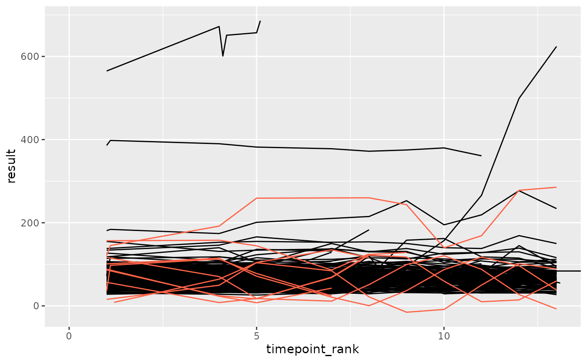
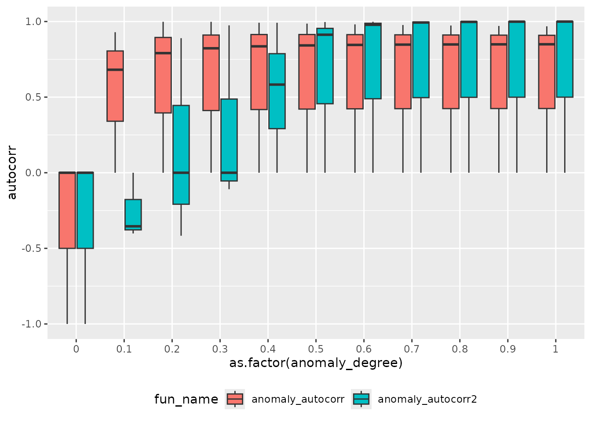
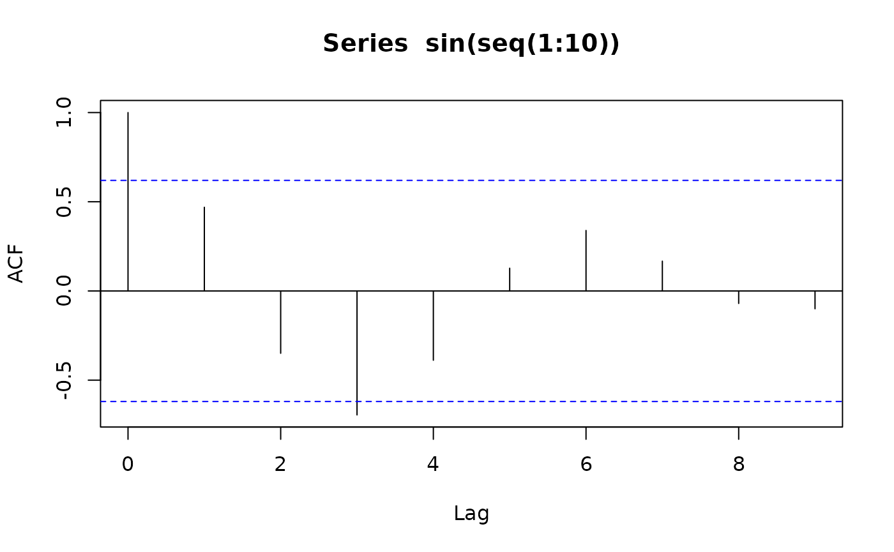
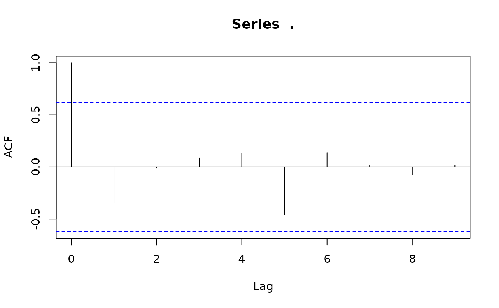
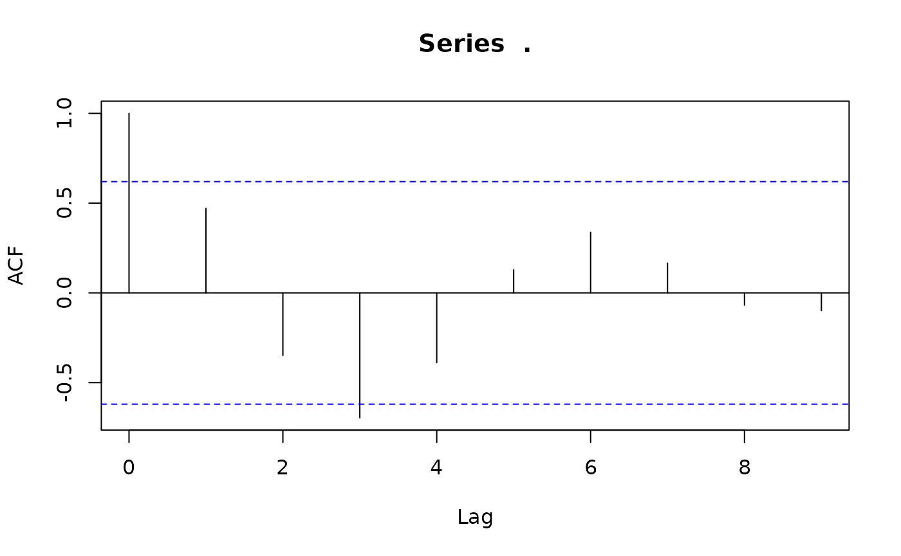

# autocorr

``` r
library(ctasval)
#> Loading required package: dplyr
#> 
#> Attaching package: 'dplyr'
#> The following objects are masked from 'package:stats':
#> 
#>     filter, lag
#> The following objects are masked from 'package:base':
#> 
#>     intersect, setdiff, setequal, union
library(ggplot2)
library(tidyr)
```

## Comparing Different Approaches for Introducing Autocorrelation to Clinical Measurements

- `anomaly_autocorr` uses a sinus function
- `anomaly_autocorr2` always adds a fraction of the lag value to the
  current value

``` r
set.seed(123)
df_prep <- prep_sdtm_lb(pharmaversesdtm::lb, pharmaversesdtm::dm, scramble = TRUE)

df_filt <- df_prep %>%
 filter(parameter_id == "Alkaline Phosphatase")

# with this wrapper functions will always generate an anomalous site with the same patients
set_seed <- function(fun, seed = 1){
  fun_seeded <- function(...) {
    set.seed(seed)
    fun(...)
  }
}


plot_anomaly <- function(df, fun, anomaly_degree, seed) {
  fun_seeded <- set_seed(fun, seed)
  df_anomaly <- fun_seeded(df, anomaly_degree = anomaly_degree)
  
  ggplot(df, aes(x = timepoint_rank, y = result, group = subject_id)) +
    geom_line(color = "black") +
    geom_line(data = df_anomaly, color = "tomato") +
    coord_cartesian(xlim = c(0, max(df_anomaly$timepoint_rank)))
}

plot_anomaly(df_filt, anomaly_autocorr, anomaly_degree = 0.7, seed = 3)
```



``` r
plot_anomaly(df_filt, anomaly_autocorr2, anomaly_degree = 0.7, seed = 3)
```


## Compare Autocorrelation Values

``` r
get_autocorr <- function(df, fun, anomaly_degree) {
  fun_seeded <- set_seed(fun)
  df_anomaly <- fun_seeded(df, anomaly_degree = anomaly_degree)
  
  df_anomaly %>%
    filter(! is.na(result)) %>%
    summarise(
      autocorr = ctas:::calculate_autocorrelation(result),
      n = n(),
      .by = subject_id
    ) %>%
    mutate(
      autocorr = ifelse(n <= 2, 0, autocorr)
    )
}

get_autocorr(df_filt, anomaly_autocorr, anomaly_degree = 0.7)
#> # A tibble: 3 × 3
#>   subject_id              autocorr     n
#>   <chr>                      <dbl> <int>
#> 1 sample_site-01-708-1272    0.847     5
#> 2 sample_site-01-709-1424    0         2
#> 3 sample_site-01-716-1308    0.977     4
```

``` r
df_grid <- tibble(
    anomaly_degree = list(seq(0, 1, 0.1)),
    fun = list(anomaly_autocorr, anomaly_autocorr2),
    fun_name = c("anomaly_autocorr", "anomaly_autocorr2")
  ) %>%
  unnest(anomaly_degree)

df_autocorr <- df_grid %>%
  mutate(
    autocorr = purrr::map2(fun, anomaly_degree, ~ get_autocorr(df_filt, .x, .y))
  ) %>%
  unnest(autocorr)
```

``` r
df_autocorr %>%
  ggplot(aes(as.factor(anomaly_degree), autocorr, fill = fun_name)) +
  geom_boxplot() +
  theme(legend.position = "bottom")
```



## Autocorrelation of a Sinus Function

### Autocorrelation of a Sinus Function considering lag 1 to 9

``` r
acf(sin(seq(1:10)))
```



### Autocorrelation of a random patient for Alkaline Phosphatase measurements considering lag 1 to 9

``` r
df_filt %>%
  filter(dense_rank(subject_id) == 1) %>%
  pull(result) %>%
  acf
```



### Autocorrelation of a random patient for Alkaline Phosphatase measurements considering lag 1 to 9

``` r
fun <- set_seed(anomaly_autocorr, seed = 10)
fun(df_filt, anomaly_degree = 10) %>%
  filter(dense_rank(subject_id) == 1) %>%
  pull(result) %>%
  acf
```



## Conclusion

`anomaly_autocorr2` which adds a fraction of the previous values
increases the autocorrelation more than `anomaly_autocorr` which uses a
sinus function.

`ctas:::calculate_autocorrelation` only uses lag 1. Even when
considering other lags a sinus function will not increase the
autocorrelation above ~ 0.6
